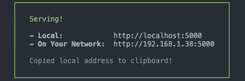

# Basic Server

Since we will be loading in data files, we need to use a basic server to serve our local files to the browser. To do this, follow the steps below. If you are interested, you can read more about why this is the case [here](https://developer.mozilla.org/en-US/docs/Learn/Common_questions/How_does_the_Internet_work), [here](https://developer.mozilla.org/en-US/docs/Learn/Common_questions/What_is_a_web_server), and [here](https://developer.mozilla.org/en-US/docs/Learn/Common_questions/set_up_a_local_testing_server).

To get going with the tutorials, open your terminal to the course directory and run:

```sh
$ npx serve
```

this will start a [simple web server](https://github.com/zeit/serve#readme) that will serve the course files. After you run this line you should see something like the following:



your files will now be available if you go to the following address in your browser `http://localhost:5000`.
